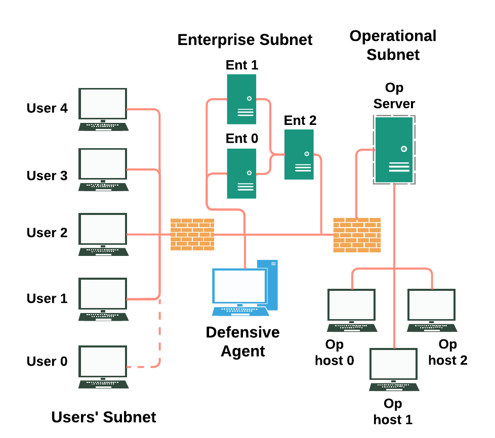

# CAGE 2 Challenge Environment - Alternate versions

This repository contains:

- A debugged version of the CAGE 2 CybORG environment that is compatible with the CAGE 2 challenge
  - [Debugged Version of CAGE 2 CybORG](./Debugged_CybORG)
- A simple and fast reimplementation of the CAGE 2 CybORG environment
  - [Mini CAGE 2 Reimplementation](./mini_CAGE)
- Additional information on how the environment works and things we’ve learnt that may be helpful for future users

# Extended CAGE 2 Developer Guide

This guide extends the previous CAGE 2 developer guide, highlighting features of the environment that are useful for successful model implementation. 

## Network Diagram

## Action Space

The blue agent can take one of several actions in each timestep: 
- analyse a host - reveals with 100% certainty the presence of an exploited host
- remove host - remove low level access users from a host
- restore host - remove privliged users from a host
- place a decoy - set-up a decoy service on a host. If selected the attacker's action will fail.

One of the unique features of the CAGE 2 environment is that both agents take actions simultaneously, rather than sequentially. This means that to some degree an agent must attempt to anticipate the actions of its opponent, especially as some actions will have a nullifying effect if they occur at the same time. Below is a list of action priorities should they occur simultaneously:

| Red Agent Action | Blue Agent Action | Priority |
|------------------|-------------------|----------|
| Escalate         | Remove            | Escalate |
| Exploit          | Decoy             | Exploit  |
| Exploit          | Restore           | Exploit  |

## Observation Space

The blue agent observation space is processed using the Wrappers available in [Wrappers](./Debugged_CybORG/CybORG/CybORG/Agents/Wrappers/) and the default wrapper is displayed in ChallengeWrapper.py. The blue agent observation has 52 features, with each four consecutive features corresponding to a single node in the network for a total of 13 nodes (in order: Def, Ent0, Ent1, Ent2, OpHost0, OpHost1, OpHost2, Opserver, User0, User1, User2, User3, User4). Each four feature can be one of five combinations describing the node's state:
- [0, 0, 0, 0] = No activity detected on host
- [1, 0, 0, 0] = Scan detected on host
- [1, 0, 1, 1] = Exploit detected in previous turn
- [0, 0, 1, 1] = Exploit detected in prior turns
- [0, 0, 1, 0] = Remove action applied to host (does not indicate successful removal) 

Scans and removal actions have 100% chance of being observed in the state, however for exploitation the probability is less clear. Exploitation actions have a 95% chance of being observed with a few exceptions (details for this can be found in [ExploitAction.py](./Debugged_CybORG/CybORG/CybORG/Shared/Actions/ConcreteActions/ExploitAction.py). SSHBruteForce always has a 100% chance of being observed, consequently an exploit on the OpServer, which can only be exploited using this method, will always be represented in the state. 

## Reward Signal

Reward is assigned based on three conditions: exploiting hosts, restoring hosts and impacting critical hosts. Each host is assigned a numeric value corresponding to its importance (ConfidentialityValue in [Scenario2.yaml](/home/harry/Documents/cyber/BlueTeam/CybORG/CybORG/Shared/Scenarios/Scenario2.yaml)). When a host is exploited this specifies the amount of reward provided: -0.1 for UserHosts and OpHosts, -1 for EntHosts and the OpServer. Using the restore action gives a reward of -1 regardless of which host it is applied to. The only host in which the impact action yields any reward is the OpServer. Allowing this host to be impacted results in a reward of -10. This reward persists until the operational server has been restored and need not be applied in every timestep as the logic of the pre-programmed agents may suggest. The total reward for each timestep is then the sum of exploited host rewards, hosts restored in that timestep and hosts currently being impacted. 

## Appendix

### Additional Information about CAGE 2 Challenge Environment

Here we are outlining various things we learnt from using this version of CybORG for the Cage 2 challenge task. 

The following info is to the best of our knowledge, and if there are intricacies that we have missed or miswritten then please feel free to contact either of this Repo’s owners and we will discuss and update.

### **True Network Diagram**

    
    <figcaption style="text-align: center;"><em>Figure 1: CAGE2 CybORG Network Diagram</em></figcaption>

**B-line Agent Trajectory**

The B-line agent moves through the network with domain knowledge of the network already, so it is aware of how to migrate to the Operational Server and impact in the quickest number of steps. 

The B-line red agent will start from one of the user host machines 1-4. There is a fifth user host (user host 0) but this cannot be acted upon from the blue agent, it seems this is how the red agent will always have a foothold on the user subnet. If the red agent attacks (DNS, exploits and privilege escalates) a user machines 1 or 2 successfully then it will move to Enterprise host 1.  If the red agent attacks (DNS, exploits and privilege escalates) user machines 3 or 4 successfully then it will move to Enterprise host 0. From here, the b-line agent is able to move to Enterprise host 2 (from either Enterprise host 0 or 1), given another successful attack. Once at Enterprise host 2, it can then directly access the Operational Server if the attack is successful and then begin Impacting this host, causing the -10 penalty for the blue agent. 

This red behaviour pattern can be seen in the [scenario2.yaml](./Debugged_CybORG/CybORG/CybORG/Shared/Scenarios/Scenario2.yaml) file and [b_line.py](./Debugged_CybORG/CybORG/CybORG/Agents/SimpleAgents/B_line.py) files. You are able to see the information each host has access to, and also what kind of machines they are (linux or windows).
It’s of note here that the Operational hosts 0, 1 and 2 are never interacted with at all.

**Meander Agent Trajectory**

Help from Harry - again the noteworthy thing here is that you can only access the operational hosts after reaching the operational server so they are again useless.

### Action Space

**Method of taking actions**

The way actions are taken is not immediately clear. However, on examination it seems as though both the red and blue agents take an action in a single turn both based on the outcome of the state prior to the step.

First the red agent takes an action based on the observation of s_, then the blue agent take an action also based on s_ with no knowledge of the red action that’s just been decided. This means that the blue agent wastes a step potentially as it doesn’t see the outcome of the red action until the next step, where the red could do something like DRS and get a foothold in the next subnet. 

It seems like when actions happen which would result in a conflicting observation space after the step, the blue agent’s action is prioritised. An example is if the red agent tries to privilege escalate a host but the blue agent decides to restore that same host in the same time step. These are mutually exclusive actions but they could both be possible to do according to s_, but we can’t have a host that is both fully compromised and restored, so Blue’s restore action will take priority in a case like this. 

**The remove action**

The remove action was always returned as a successful action, despite whether it actually was or not (see issue 1 in [Debugged Version of CAGE 2 CybORG](./Debugged_CybORG) - this was fixed). 

Another intricacy with the remove action seems to be with it only working for specific exploits on specific hosts. 
This is because the remove action only work if the usernames associated with the ports the exploits were occurring 
on were ‘root’ or ‘SYSTEM’ then the remove action would fail. This was the case for some exploits, so this means 
that remove will not always work for every exploit on every host. This may not be a bug, more of feature of the 
system. But we feel it is still worth mentioning to help understand any behaviour that may not make sense otherwise. 
The info in the Hosts to Default Processes,Ports and users Mapping Table in the Appendix may be of use if a remove action is not working as expected, as it may be due to the user being 'root' or 'SYSTEM' for that process on that port.

### Appendix

### Decoy Deployment Strategy

| Host     | OS      | Local Ports                  | Decoys                     | Decoy Order                                                    | Initial Exploit Order                               |
|----------|---------|-----------------------------|----------------------------|----------------------------------------------------------------|-----------------------------------------------------|
| **User0** | Windows | 21, 22                    | Apache, Smss, Svchost, Tomcat  | Svchost - 1   Smss - 2   Apache - 3   Tomcat - 4      | FTPDirTraversal (port 21) : 7   SSHBruteForce (port 22) : 0.1 |
| **User1** | Windows | 21, 22                    | Apache, Smss, Svchost, Tomcat  | Svchost - 1   Smss - 2   Apache - 3   Tomcat - 4      | FTPDirTraversal (port 21) : 7   SSHBruteForce (port 22) : 0.1 |
| **User2** | Windows | 445, 139, 135, 3389 | Apache, SSHd, Tomcat, Femitter | SSHd - 0.1   Apache - 3   Tomcat - 4   Femitter - 7  | EternalBlue (port 139) : 2   BlueKeep (port 3389) : 1 |
| **User3** | Linux   | 25, 80, 443, 3390   | SSHd, Vsftpd                | SSHd - 0.1   Vsftpd - 7                                     | HarakaRCE (port 25) : 6   SQLInjection (port 3390 and 80/443) : 5   HTTPsRFI (port 443) : 4   HTTPRFI (port 80) : 3   BlueKeep (port 3389) : 1 |
| **User4** | Linux   | 22, 80, 3390, 443, 25 | Vsftpd                    | Vsftpd - 7                                                     | HarakaRCE (port 25) : 6   SQLInjection (port 3390 and 80/443) : 5   HTTPsRFI (port 443) : 4   HTTPRFI (port 80) : 3   BlueKeep (port 3389) : 1 |
| **Ent0** | Linux   | 22                          | Apache, Tomcat, Vsftpd, HarakaSMPT | Apache - 3   Tomcat - 4   Vsftpd - 7   HarakaSMPT - 6 | SSHBruteForce (port 22) : 0.1 |
| **Ent1** | Windows | 22, 135, 3389, 445, 139, 80, 443 | Femitter         | Femitter - 7                                                  | HTTPsRFI (port 443) : 4   HTTPRFI (port 80) : 3   EternalBlue (port 139) : 2   BlueKeep (port 3389) : 1   SSHBruteForce (port 22) : 0.1 |
| **Ent2** | Windows | 22, 135, 3389, 445, 139, 80, 443 | Femitter         | Femitter - 7                                                  | SSHBruteForce (port 22) : 0.1 |
| **Op_host0** | Linux| 22                          | Apache, HarakaSMPT, Tomcat, Vsftpd | Vsftpd - 7   HarakaSMPT - 6   Tomcat - 4   Apache - 3 | SSHBruteForce (port 22) : 0.1 |
| **Op_host1** | Linux| 22                          | Apache, HarakaSMPT, Tomcat, Vsftpd | Vsftpd - 7   HarakaSMPT - 6   Tomcat - 4   Apache - 3 | SSHBruteForce (port 22) : 0.1 |
| **Op_host2** | Linux| 22                          | Apache, HarakaSMPT, Tomcat, Vsftpd | Vsftpd - 7   HarakaSMPT - 6   Tomcat - 4   Apache - 3 | SSHBruteForce (port 22) : 0.1 |
| **Op_Server0** | Linux| 22                        | Apache, HarakaSMPT, Tomcat, Vsftpd | Vsftpd - 7   HarakaSMPT - 6   Tomcat - 4   Apache - 3 | SSHBruteForce (port 22) : 0.1 |

In the decoy order column, the numbers that are after each decoy refer to the ranking of the decoy in the order of priority. The lower the number, the higher the priority and this is hardcoded in the exploit_options dictionary in 
the `Debugged_CybORG/CybORG/CybORG/Shared/Actions/AbstractActions/ExploitRemoteService.py` file.

### Exploits to decoy to process mapping table

| **Exploits**              | **Decoys**                       | **Processes** |
|---------------------------|----------------------------------|--------------|
| EternalBlue               | decoySmss                        | smss.exe     |
| BlueKeep                  | decoySvchost                     | svchost.exe  |
| HTTPRFI                   | decoyApache                      | apache2      |
| HTTPSRFI                  | decoyTomcat                      | tomcat8.exe  |
| SSH BruteForce            | decoySSHD                        | sshd.exe/sshd |
| SQL Injection             | -                                | mysql        |
| Haraka RCE                | decoyHarakaSMTP                  | smtp         |
| FTP Directory Traversal   | decoyFemitter,   decoyVsftpd | femitter.exe |

### Hosts to Default Processes, Ports and users Mapping Table

| **Hostname** | **Ports**          | **Users**          | **Processes**        |
|-----------------------|--------------------|--------------------|----------------------|
| User1           | 22, 21             | SSHD_SERVER, SYSTEM | SSHD.EXE, FEMITTER.EXE |
| User2           | 445, 139, 135, 3389 | SYSTEM, SYSTEM, NETWORK | SMSS.EXE, SVCHOST.EXE, SVCHOST.EXE |
| User3          | 3389, 80, 443, 25  | ROOT, WWW-DATA, ROOT | MYSQL, APACHE2, SMTP |
| User4           | 22, 3390, 80, 443, 25 | ROOT, ROOT, WWW-DATA, ROOT | SSHD, MYSQL, APACHE2, SMTP |
| Ent0       | 22                 | ROOT               | SSHD.EXE              |
| Ent1       | 22, 135, 3389, 445, 139, 80, 443 | SSHD_SERVER, SYSTEM, SYSTEM, SYSTEM, NETWORK | SSHD.EXE, SVCHOST.EXE, SVCHOST.EXE, SMSS.EXE, TOMCAT8.EXE |
| Ent2       | 22, 135, 3389, 445, 139, 80, 443 | SSHD_SERVER, SYSTEM, SYSTEM, SYSTEM, NETWORK | SSHD.EXE, SVCHOST.EXE, SVCHOST.EXE, SMSS.EXE, TOMCAT8.EXE |
| Op_Server      | 22                 | ROOT               | SSHD                 |
| Op_host0      | 22                 | ROOT               | SSHD                 |
| Op_host1     | 22                 | ROOT               | SSHD                 |
| Op_host2     | 22                 | ROOT               | SSHD                 |
| Defender          | 22, 53, 78         | ROOT, SYSTEMD+     | SSHD, SYSTEMD        |

####################

*** Look at Developer_guide file to see if more issue arise from reading.

- True network diagram
    - Bline agent trajectory
    - Meander agent trajectory
- Actions:
    - Method of taking actions (simultaneous)
        - hierarchy of priority for mutually exclusive actions
    - Talk about Remove (ref issue in my directory)
        - what makes remove work
    - Placing a decoy - ref decoy mapping table
- Observation
    - Vector obs space explanation - what do the bits mean?
    - <95% visibility for blue agent usually
    - All impacts and exploits are visible on the Obs server
    - 100% of brute force exploits are visible
- Rewards
    - Confirm when you get the -10 reward
    - How rewards accumulate

- Appendix
    - Decoy mapping table - hosts
    - Exploits to decoy table
    - Default process and ports
    - Usernames and Password